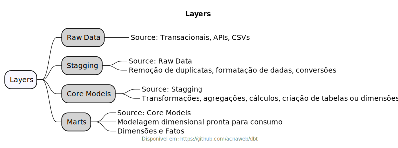

# dbt

## Medallion Architecture

- https://i-spark.nl/en/blog/dbt-naming-conventions-and-medallion-architecture/
- https://sqlpatterns.com/p/designing-an-evolutionary-data-architecture




## Basics

```sh
export DBT_PROFILE_DIR=$(pwd)/profiles
dbt init <project_name> --profiles-dir=$DBT_PROFILE_DIR
export DBT_PROJECT_DIR=$(pwd)/projects/<project_name>
dbt debug --profiles-dir=$DBT_PROFILE_DIR
dbt run --profiles-dir=$DBT_PROFILE_DIR --target dev
dbt seed --profiles-dir=$DBT_PROFILE_DIR
dbt test --profiles-dir=$DBT_PROFILE_DIR
dbt docs generate --profiles-dir=$DBT_PROFILE_DIR
dbt docs serve --profiles-dir=$DBT_PROFILE_DIR --host 0.0.0.0 --port 8080
```

## Studies

* [Study Postgres](chapters/study_postgres.md)
* [Study Sqlite](chapters/study_sqlite.md)
* [Study Mart](chapters/study_mart.md)
* [Study Macro](chapters/study_macro.md)
* [Study Dagster](chapters/dbt_dagster_project.md)
* [Study Test](chapters/study_test.md)


## References

- https://www.getdbt.com/